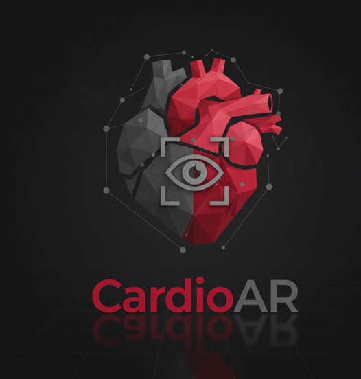
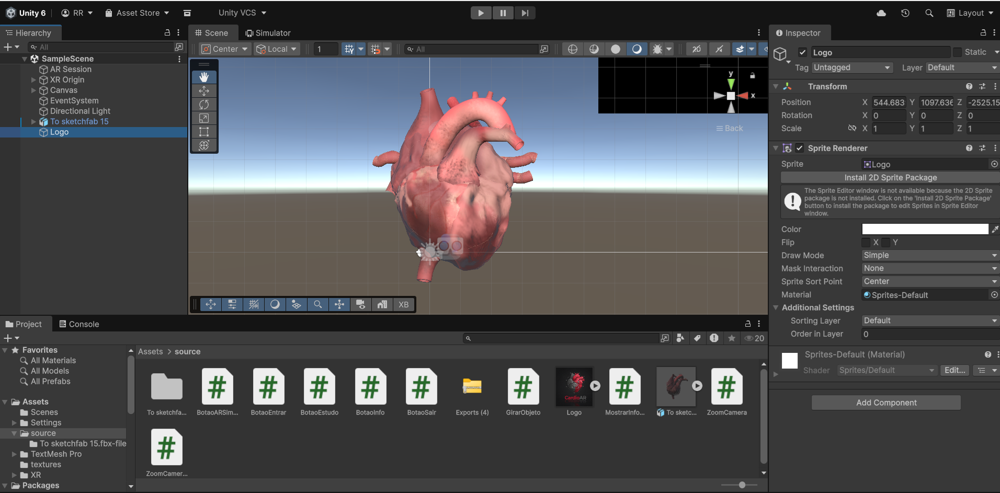
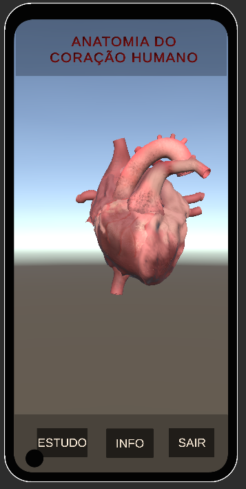
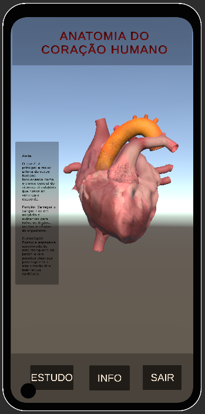
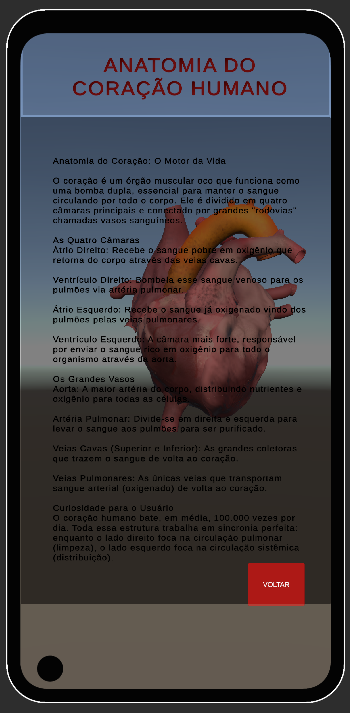

<p align="center">
  <strong>Universidade Federal do Maranhão</strong><br>
  <strong>Centro de Ciências Exatas e Tecnologias</strong><br>
  <strong>Curso Engenharia da Computação</strong><br>
  <strong>Disciplina: Computação Gráfica</strong><br>
  <strong>Prof. Dr. Haroldo Gomes Barros Filho</strong>
</p>

<hr>

<p align="center">
  <em>Este projeto foi desenvolvido como parte das atividades da disciplina de <strong>Computação Gráfica,</strong> no curso de Engenharia da Computação da Universidade Federal do Maranhão. A proposta consistiu na criação de um aplicativo educacional interativo, e sua culminância — representada pelo desenvolvimento funcional do aplicativo <strong>CardioAR</strong> e pela apresentação desta documentação técnica — corresponde às avaliações de <strong>Nota 2</strong> e <strong>Nota 3</strong> da disciplina.</em>
</p>

<p align="center">
  
</p>

<h1 align="center">🫀 CardioAR</h1>

<p align="center">
  
  
  
  
  
  
</p>


---

## 🧠 Sobre o Projeto

**CardioAR** é um aplicativo educacional interativo desenvolvido em **Unity 6,** com foco na **visualização anatômica do coração humano** em 3D e em **realidade aumentada (AR).**
O projeto une **computação gráfica,** **ciência biomédica** e **tecnologia imersiva,** oferecendo uma ferramenta inovadora para o ensino e a difusão científica na área da saúde.

Por meio de uma interface intuitiva e recursos interativos, o usuário pode explorar o coração humano em detalhes, manipulando o modelo 3D com os dedos e posicionando-o em qualquer ambiente físico através da câmera do celular.

---

## 🎯 Objetivo Científico

O coração é um órgão vital e complexo, cuja compreensão anatômica é essencial para profissionais da saúde. O CardioAR foi desenvolvido com os seguintes propósitos:

- Promover o **ensino ativo** da anatomia cardíaca por meio de recursos digitais tridimensionais.
- Permitir **interação direta** com o modelo anatômico, favorecendo a assimilação espacial das estruturas.
- Integrar **realidade aumentada** como ferramenta pedagógica em ambientes acadêmicos e clínicos.
- Apoiar **docentes, discentes e pesquisadores** em atividades de ensino, treinamento e extensão universitária.

---

## ⚙️ Funcionalidades Técnicas

- **Modelo 3D realista** do coração humano, com texturas e proporções anatômicas precisas.
- **Manipulação tátil:** o usuário pode rotacionar, ampliar e mover o coração com gestos na tela.
- **Realidade aumentada:** o coração pode ser posicionado em qualquer superfície física usando a câmera do dispositivo.
- **Painel informativo** com descrições técnicas das estruturas cardíacas.
- **Interface responsiva** com botões de navegação: *Entrar,* *Sair,* *Avançar,* *Estudo Aprofundado.*
- **Modo de estudo aprofundado** com textos explicativos e foco em cada componente anatômico.
- **Compatível com Android** (.apk exportável).
- Preparado para integração com **AR Foundation** e dispositivos XR.

---

## 🛠️ Tecnologias Utilizadas

- **Unity 6:** motor gráfico para desenvolvimento multiplataforma.
- **C#:** linguagem de programação para lógica interativa.
- **TextMeshPro:** biblioteca para renderização de textos científicos.
- **AR Foundation:** framework para realidade aumentada nativa.
- **ARCore:** plataforma do Google para realidade aumentada em dispositivos Android, utilizada para rastreamento espacial e ancoragem de objetos 3D no ambiente físico.
- **Git/GitHub:** controle de versão e colaboração.
- **Pipeline Android Build:** exportação para dispositivos móveis.

---

## 📚 Conteúdo Científico

Cada estrutura cardíaca é acompanhada de uma descrição técnica baseada em literatura biomédica:

- **Átrio direito:** recebe sangue venoso das veias cavas.
- **Átrio esquerdo:** recebe sangue oxigenado das veias pulmonares.
- **Ventrículo direito:** envia sangue para os pulmões pela artéria pulmonar.
- **Ventrículo esquerdo:** bombeia sangue oxigenado para a aorta.
- **Válvula tricúspide:** regula o fluxo entre átrio e ventrículo direitos.
- **Válvula mitral:** regula o fluxo entre átrio e ventrículo esquerdos.
- **Válvula pulmonar:** controla a saída de sangue para os pulmões.
- **Válvula aórtica:** controla a saída de sangue para o corpo.
- **Aorta:** principal artéria sistêmica, distribui sangue oxigenado.
- **Veias cavas:** conduzem sangue venoso ao coração.

---

## 📸 Demonstrações Visuais

### Ambiente de Desenvolvimento
<p align="center">
  
</p>

### Visualização do coração em 3D
<p align="center">
  
</p>

### Painel com descrição anatômica
<p align="center">
  
</p>

### Interface com estudo aprofundado
<p align="center">
  
</p>

---

## 👥 Público-Alvo

Este projeto é voltado para:

- Estudantes de graduação em medicina, enfermagem e áreas afins.
- Professores de anatomia, fisiologia e ciências biomédicas.
- Profissionais da saúde em formação continuada.
- Pesquisadores em tecnologias educacionais aplicadas à saúde.

---

# 🚀 Como Executar o Projeto (Passo a Passo Detalhado)

Esta seção descreve **detalhadamente** como executar o projeto **CardioAR,** desde o download do código-fonte até a geração e instalação do aplicativo no celular Android.

Os passos foram escritos de forma **simples e sequencial,** de modo que **qualquer pessoa,** mesmo sem experiência prévia com Unity, consiga reproduzir o experimento.

---

## 🖥️ Requisitos Básicos

Antes de iniciar, é necessário possuir:

- Um **computador** com Windows, Linux ou macOS
- **Acesso à internet**
- Um **celular Android** (Android 8.0 ou superior)
- **Espaço livre em disco** (mínimo recomendado: 5 GB)

---

## 📥 Passo 1 — Instalar o Unity Hub

1. Acesse o site oficial do Unity:  
   👉 https://unity.com/download
2. Clique em **Download Unity Hub**.
3. Execute o instalador e conclua a instalação.
4. Abra o **Unity Hub** após a instalação.

> ℹ️ O Unity Hub é o programa responsável por gerenciar versões do Unity e projetos.

---

## 📦 Passo 2 — Instalar a versão correta do Unity

1. No **Unity Hub,** clique em **Installs.**
2. Clique em **Install Editor.**
3. Selecione a versão **Unity 6.2.**
4. Durante a instalação, **marque obrigatoriamente:**
   - ✅ Android Build Support  
   - ✅ Android SDK & NDK Tools  
   - ✅ OpenJDK
5. Conclua a instalação.

> ⚠️ Sem esses módulos, **não é possível gerar a APK para Android.**

---

## 📂 Passo 3 — Baixar (clonar) o projeto CardioAR

### 🔹 Opção A — Via Git (recomendado)

1. Abra o **Prompt de Comando** (Windows) ou **Terminal** (Linux/macOS).
2. Digite o comando abaixo e pressione **Enter:**

```bash
git clone https://github.com/ahcorataner/cardioAR.git
````

3. Aguarde o download do projeto.

---

### 🔹 Opção B — Download manual (sem Git)

1. Acesse o repositório do projeto:
   👉 [https://github.com/ahcorataner/cardioAR](https://github.com/ahcorataner/cardioAR)
2. Clique no botão **Code.**
3. Selecione **Download ZIP.**
4. Extraia o arquivo ZIP em uma pasta de sua preferência.

---

## 🎮 Passo 4 — Abrir o projeto no Unity

1. Abra o **Unity Hub.**
2. Clique em **Add Project.**
3. Selecione a pasta **CardioAR** (pasta principal do projeto).
4. Clique em **Open.**
5. Aguarde o Unity importar todos os arquivos.

> ⏳ Esse processo pode levar alguns minutos na primeira abertura.

---

## ▶️ Passo 5 — Executar o projeto no computador (opcional)

1. Com o projeto aberto, clique no botão **Play (▶️)** no topo da tela.
2. O aplicativo será executado dentro do Unity para testes básicos.
3. Clique em **Stop** para encerrar a execução.

---

## 📱 Passo 6 — Configurar o projeto para Android

1. No menu superior, clique em **File → Build Settings.**
2. Selecione a opção **Android.**
3. Clique em **Switch Platform** e aguarde a conversão.

---

## ⚙️ Passo 7 — Configurar as definições do aplicativo

1. Ainda em **Build Settings,** clique em **Player Settings.**
2. Preencha os campos da seguinte forma:

* **Company Name:** `ahcorataner`
* **Product Name:** `CardioAR`
* **Package Name:** `com.ahcorataner.cardioar`

3. Verifique se:

   * **Scripting Backend:** `IL2CPP`
   * **Target Architectures:** `ARMv7` e `ARM64` marcados

---

## 📦 Passo 8 — Gerar o aplicativo Android (APK)

1. Em **Build Settings,** clique em **Build.**
2. Escolha uma pasta para salvar o arquivo.
3. Nomeie o arquivo como:

```text
CardioAR.apk
```

4. Aguarde a finalização do processo.

🎉 **A APK foi gerada com sucesso!**

---

## 📲 Passo 9 — Instalar o aplicativo no celular

1. Copie o arquivo **CardioAR.apk** para o celular Android.
2. No celular, ative:

   * **Configurações → Segurança → Permitir apps de fontes desconhecidas**
3. Toque no arquivo APK e conclua a instalação.
4. Abra o aplicativo **CardioAR.**

---

## ✅ Resultado Esperado

Após a instalação, o usuário poderá:

* Visualizar o **modelo 3D do coração humano**
* Interagir com o modelo por toque
* Utilizar recursos de **realidade aumentada**
* Acessar conteúdos educativos sobre **anatomia cardíaca**

---

## 🔗 Versão pronta para uso

Para usuários que **não desejam compilar o projeto,** a versão funcional do aplicativo **CardioAR** para dispositivos Android está disponível para download público por meio do GitHub Releases:
🔗 **Download direto da APK:** 

👉 [https://github.com/ahcorataner/cardioAR/releases/download/v1.0/CardioAR.apk](https://github.com/ahcorataner/cardioAR/releases/download/v1.0/CardioAR.apk)

> ⚠️ Para instalar o aplicativo, é necessário permitir a instalação de apps de fontes desconhecidas nas configurações do Android.
---

## 📄 Licença

Este projeto está licenciado sob a **MIT License.**
Consulte o arquivo `LICENSE` para mais detalhes.

---

## ✨ Autoria

Desenvolvido por **Renata Costa Rocha (@ahcorataner)**  
Projeto acadêmico e científico com foco em **Educação Médica Interativa.**

